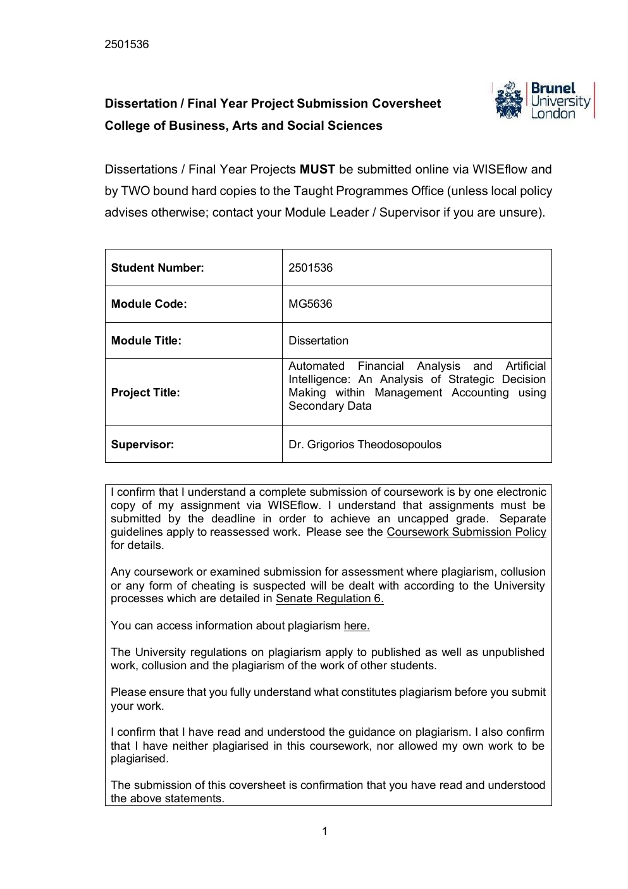
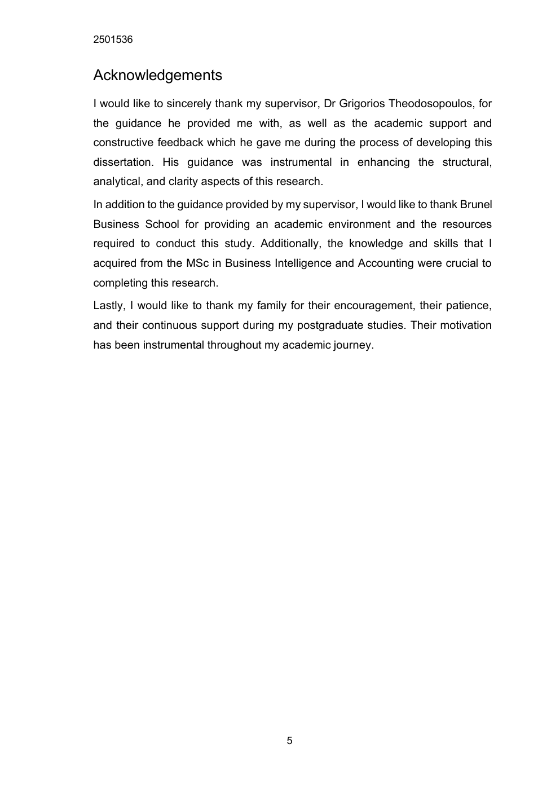
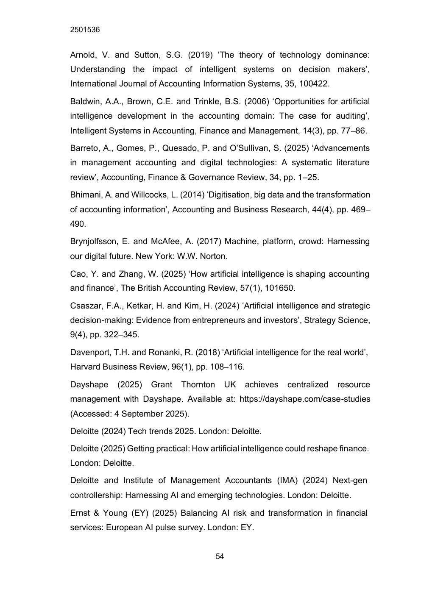

# Automated Financial Analysis & Artificial Intelligence

> **MSc Dissertation | Accounting & Business Intelligence | Brunel University London**

A research project examining how **Financial Automation Analysis (FAA)** and Artificial Intelligence can support strategic decision-making within management accounting.

## Research Question

The dissertation investigates the strategic implications of AI-enabled Financial Automation Analysis within management accounting, using a **theory-driven secondary data analysis** approach.

## Research Focus

The study examines how AI-enabled financial analysis can influence:

- Decision quality
- Technological integration
- Ethical governance and trust
- Professional transformation
- Organisational agility

The dissertation applies three complementary theoretical lenses:

1. **Decision Theory / Bounded Rationality**
2. **Socio-Technical Systems (STS) Theory**
3. **Dynamic Capabilities Framework**

## Key Themes

The research considers AI-enabled capabilities such as automated reporting, forecasting, variance analysis, performance dashboards and scenario modelling. It also evaluates governance, professional capability and organisational context rather than treating technology alone as the source of strategic value.

## Methodology

The dissertation uses **theory-driven secondary data analysis**. It synthesises academic and industry evidence to evaluate the strategic role of Financial Automation Analysis in management accounting.

## Key Conclusion

The study concludes that Financial Automation Analysis can support more informed strategic decision-making, but the value of automation depends on appropriate governance, professional capability and organisational context. The findings therefore frame AI-enabled finance transformation as a socio-technical change rather than a purely technical implementation.

## Repository Contents

- `MSc_Dissertation_Automated_Financial_Analysis_AI.pdf` — full dissertation
- `assets/` — selected visuals for the repository README

## Skills / Research Areas

`Financial Analysis` `Management Accounting` `Artificial Intelligence` `Strategic Decision-Making` `Financial Automation Analysis` `Secondary Data Analysis` `Business Research` `Finance Transformation` `AI Governance`

## Academic Context

**Programme:** M.Sc. Accounting & Business Intelligence  
**Institution:** Brunel University London  
**Research approach:** Theory-driven secondary data analysis

---

### Author
**Mark Maxwel Louis**  
M.Sc. Accounting & Business Intelligence — Brunel University London
